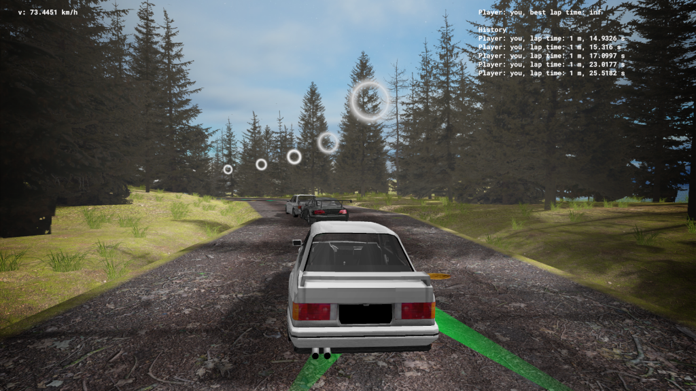
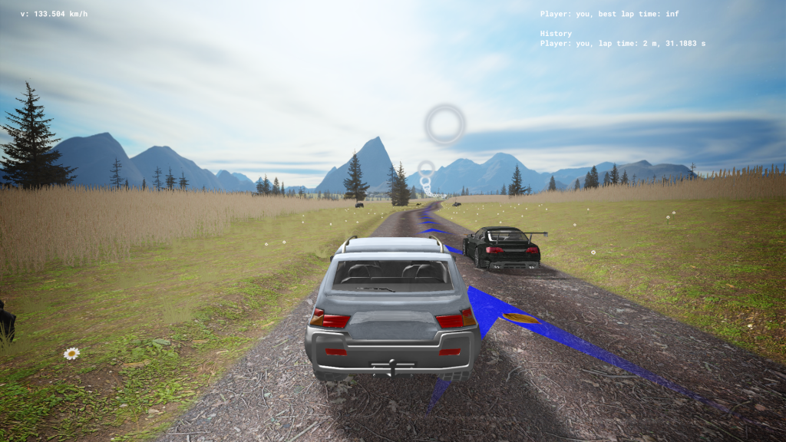
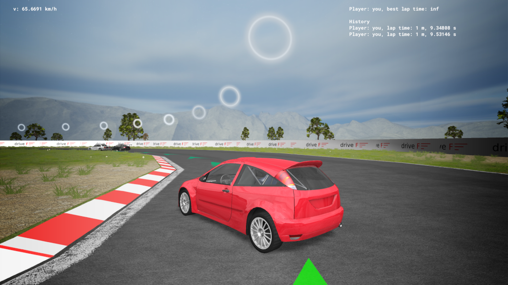
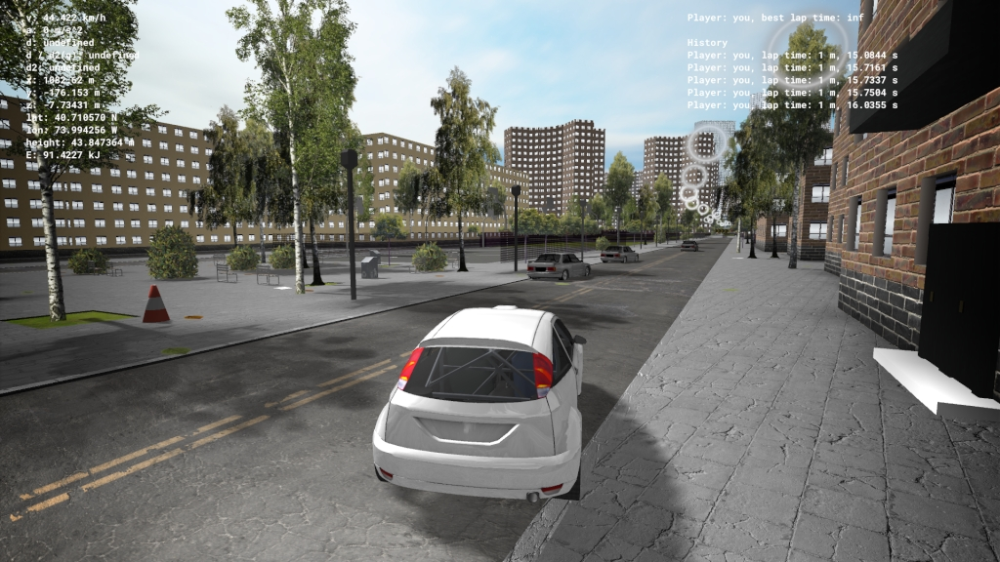
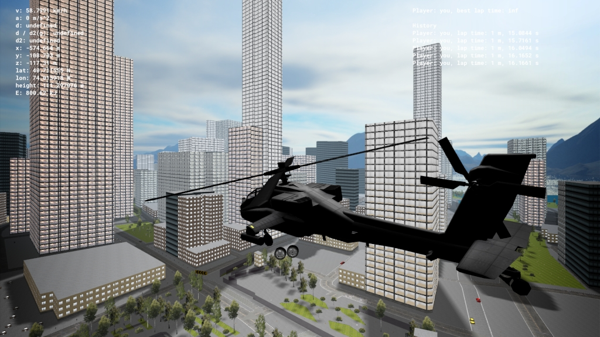
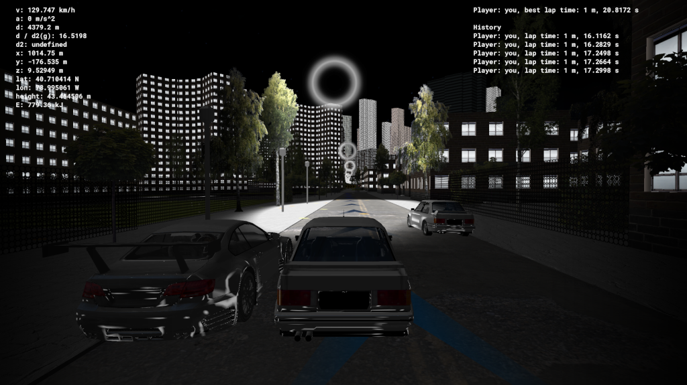
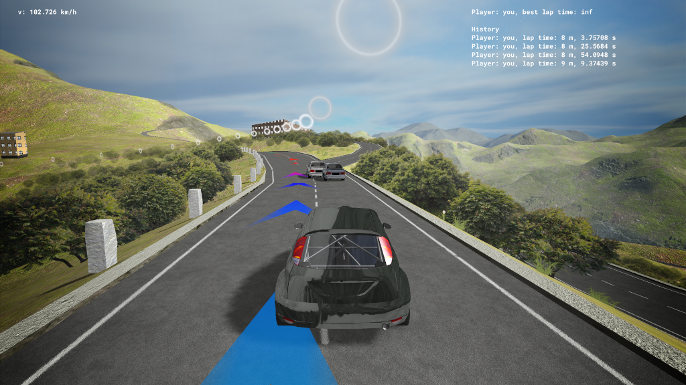
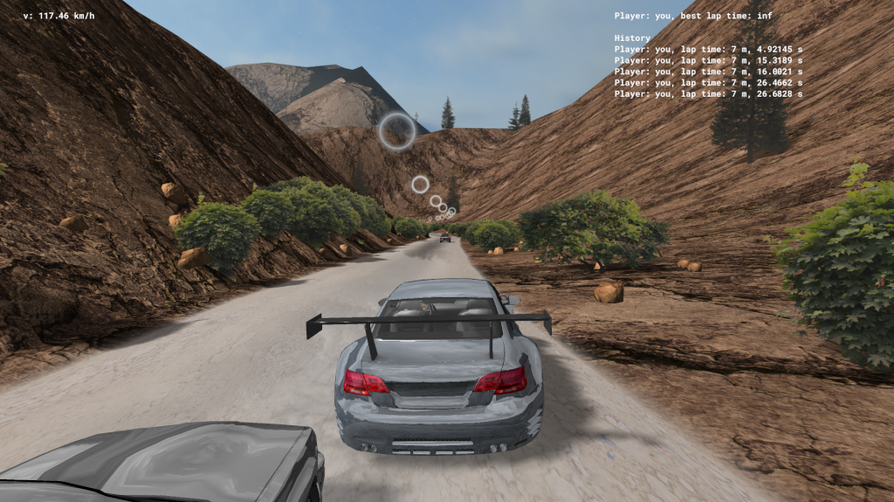
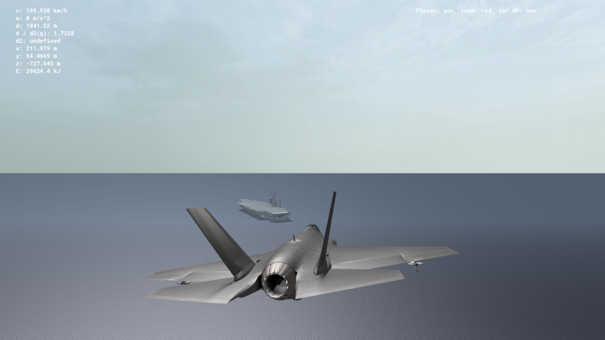

# MGame

A rally game based on OpenStreetMap data.

## Screenshots

### Forest 0

### Track JB

### Racetrack 0

### New York City

### New York City (fly)

### New York City (at night)

### Großglockner High Alpine Road

### Canyon1

### Aircraft carrier 0

