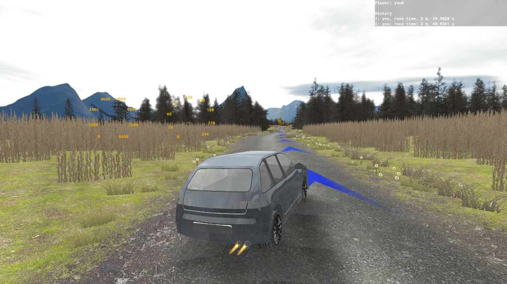
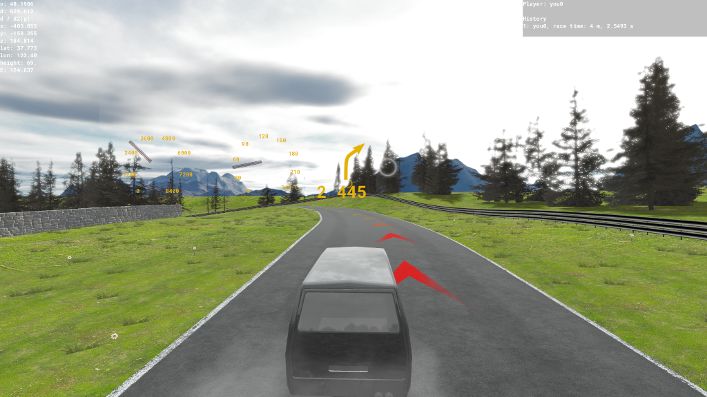
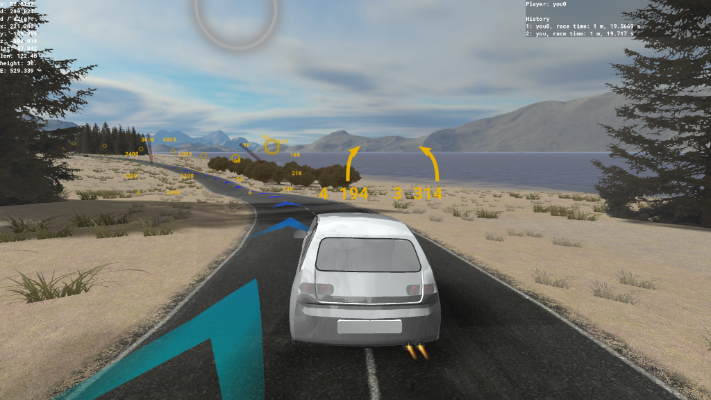
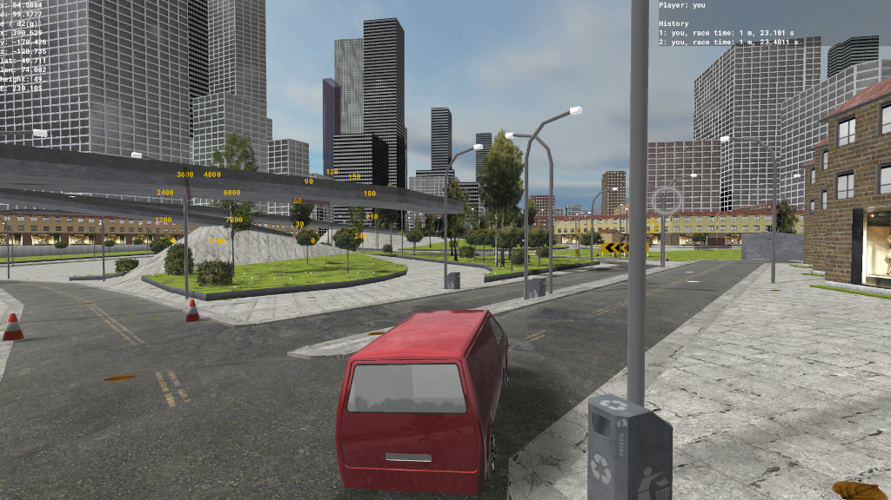
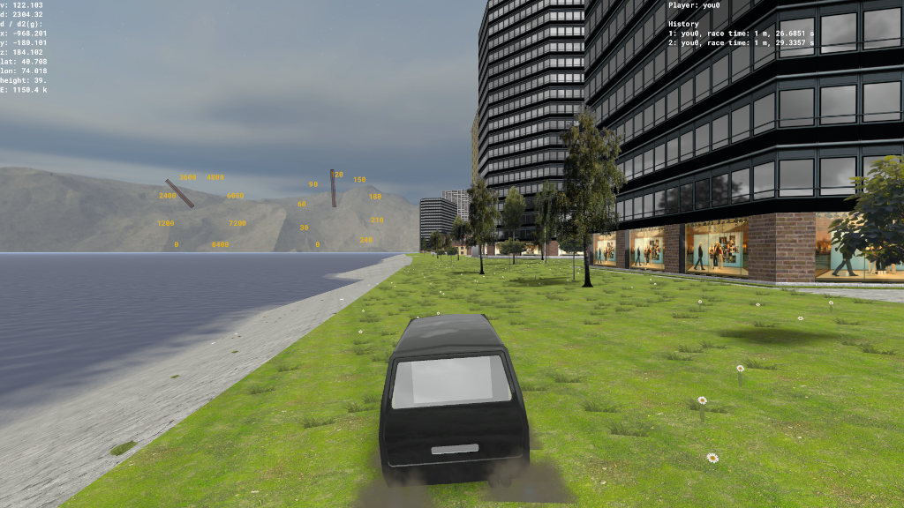
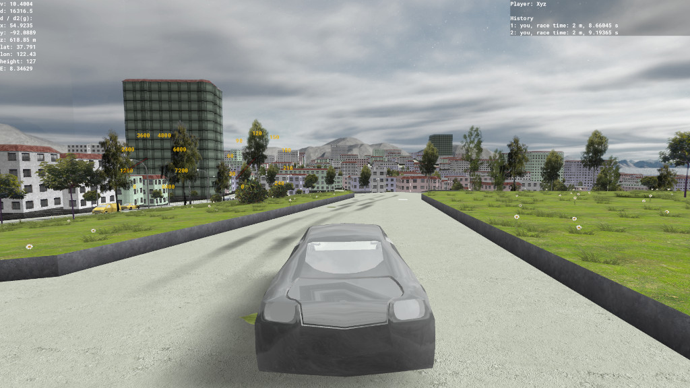

# MGame

## !!! WARNING !!!

Please note that I cannot guarantee correctness and safety of the code, as SHA256 is not secure.

echo jk | sha256sum:
**720d**aff2aefd2b3457cbd597509b0fa399e258444302c2851f8d3cdd8ad781eb

echo ks | sha256sum:
**1aa**44e718d5bc9b7ff2003dbbb6f154e16636d5c2128ffce4751af5124b65337

echo xy | sha256sum:
3b2fc206fd92be3e70843a6d6d466b1f400383418b3c16f2f0af89981f**1337**f3

echo za | sha256sum:
28832ea947ea9588ff3**acbad**546b27fd001a875215beccf0e5e4eee51cc81a2e

A rally game based on OpenStreetMap data.

The [release section on GitHub](https://github.com/gre-42/MGame/releases) contains executables of the PC version (Linux and Windows), while the Android build can be downloaded [from Google Play](https://play.google.com/store/apps/details?id=com.hallo2hallo.vanillarally).

For instructions how to add a custom stage, see [CONTRIBUTING](CONTRIBUTING.md).

## Screenshots

### Track JB

### Snow 1

### Retro race track 1

### Island 0

### Forest 0

### Desert 1

### Race track 0

### Großglockner High Alpine Road

### New York City

### San Francisco

## Acknowledgments  

Special thanks to the [OpenStreetMap community](https://www.openstreetmap.org/) for
providing high-quality mapping data. Join the OpenStreetMap community to contribute
to the mapping data that powers MGame!
