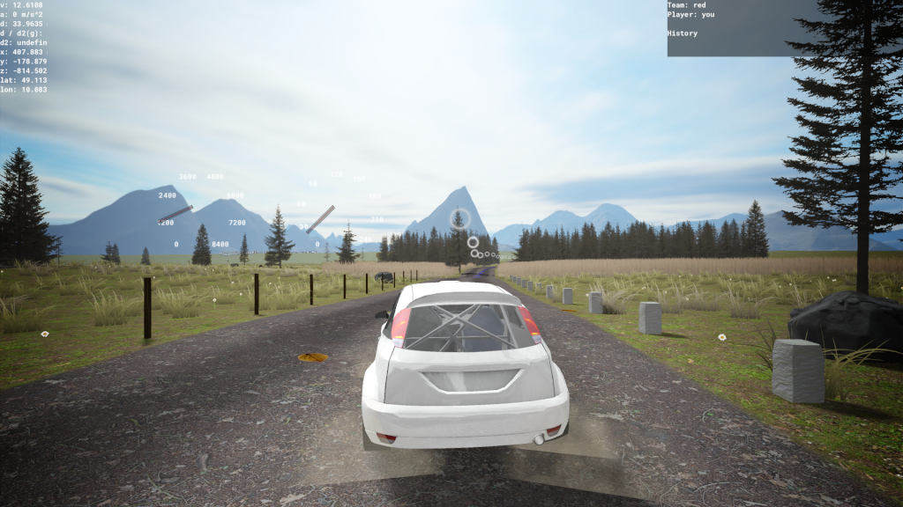
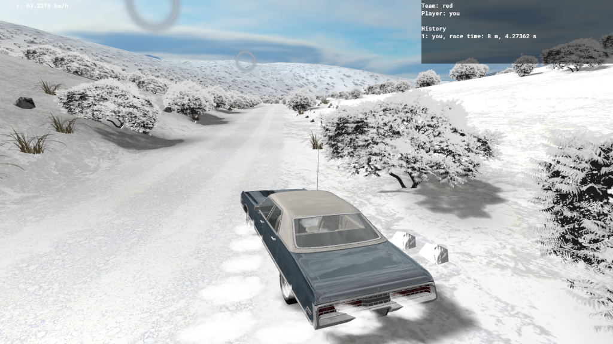
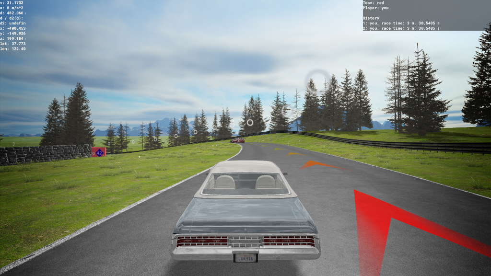
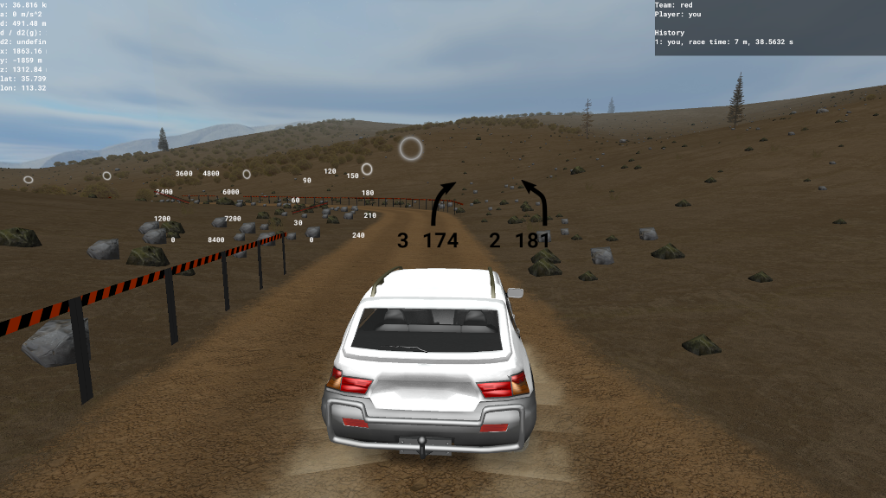
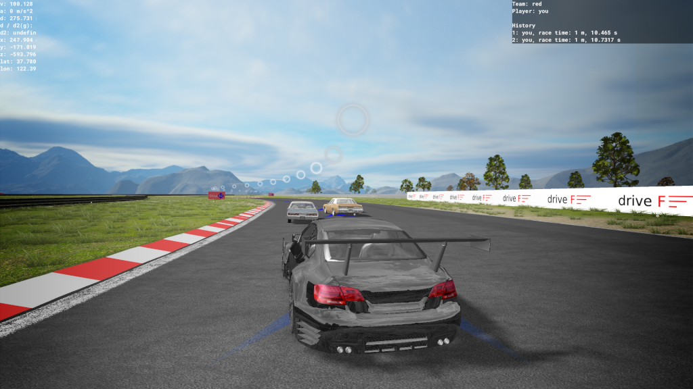
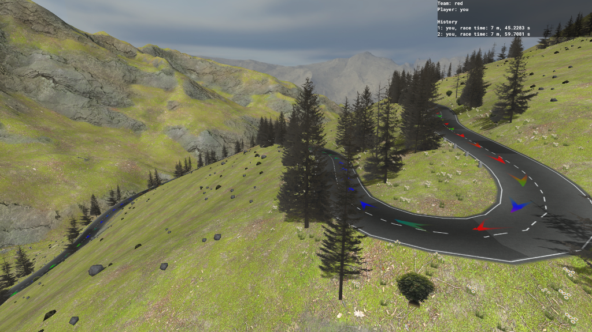
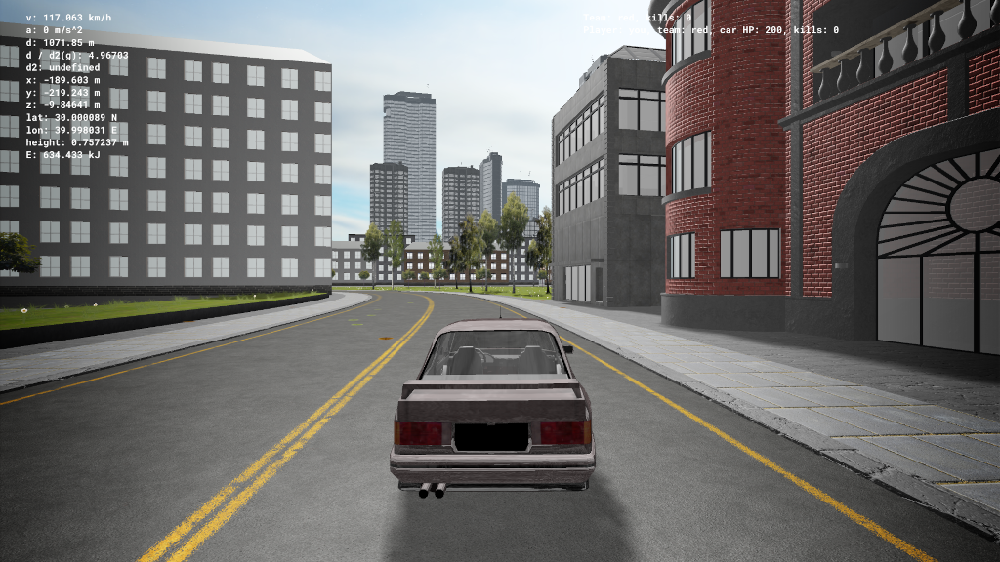
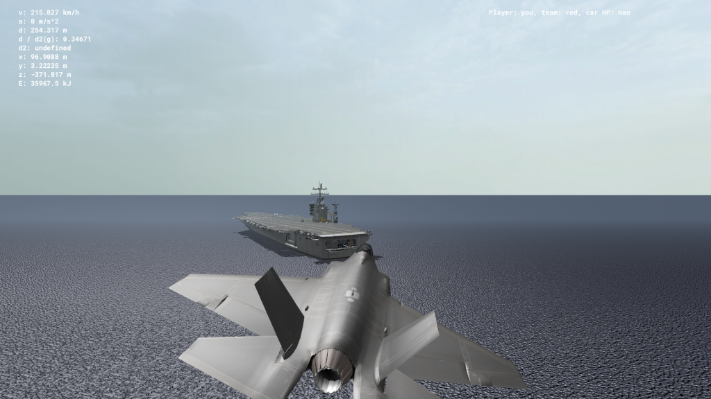
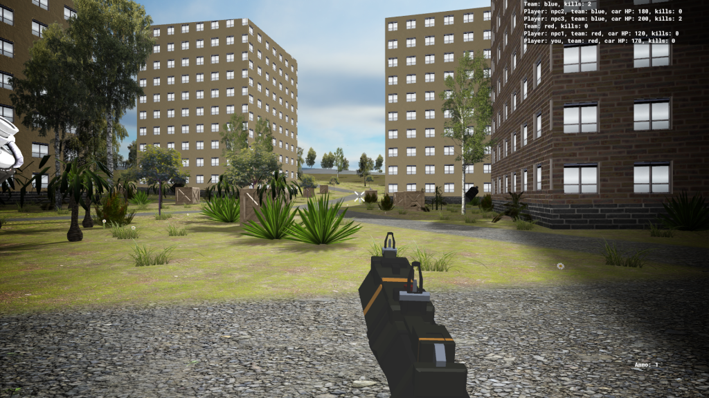

# MGame

A rally game based on OpenStreetMap data.

## Screenshots

### Track JB

### Snow 1

### Retro race track 1

### Island 0

### Forest 0

### Desert 1

### Race track 0

### Großglockner High Alpine Road

### New York City

### New York City (fly)

### New York City (at night)

### City 0

### Aircraft carrier 0

### Team deathmatch 0

