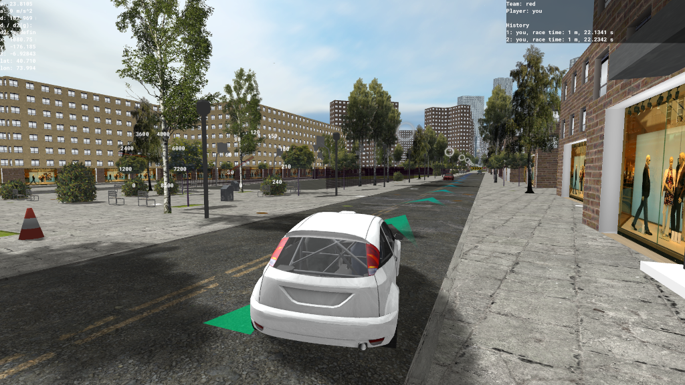
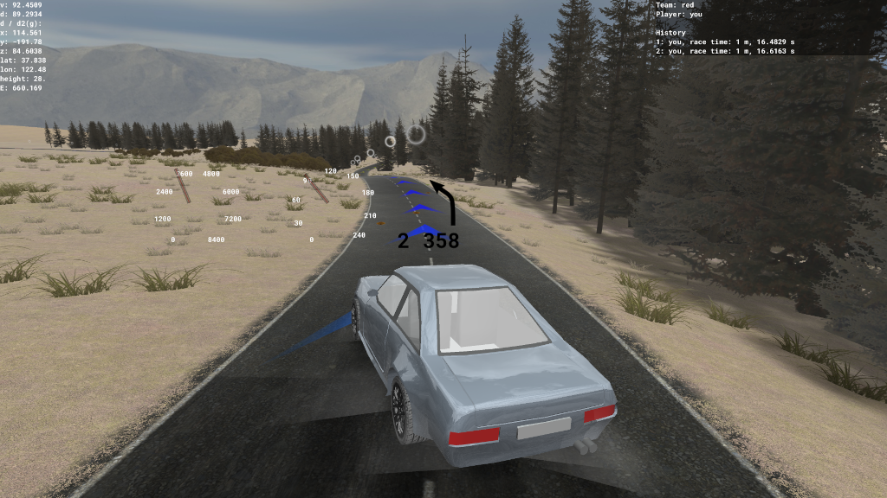
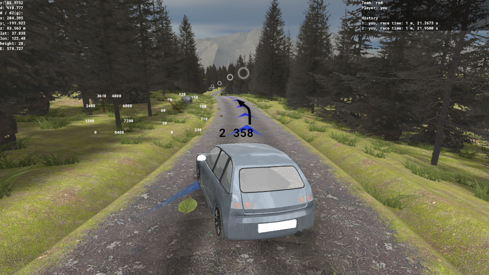
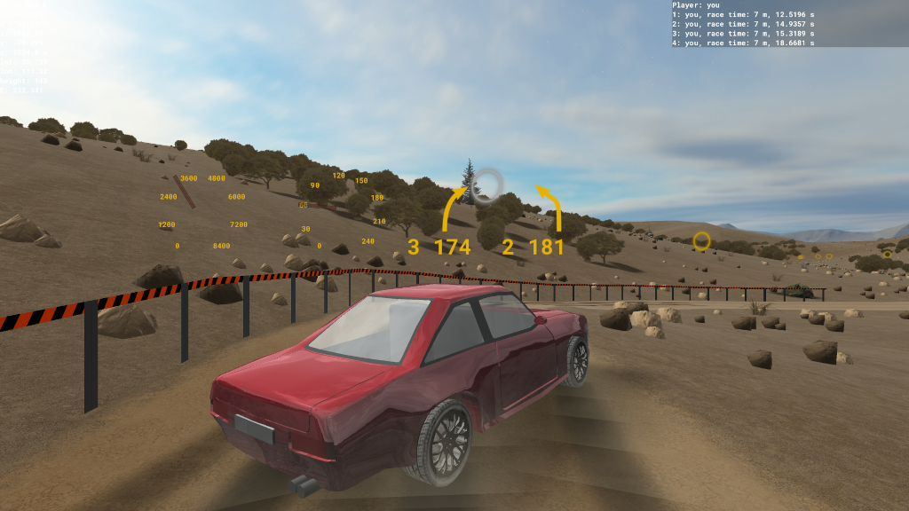
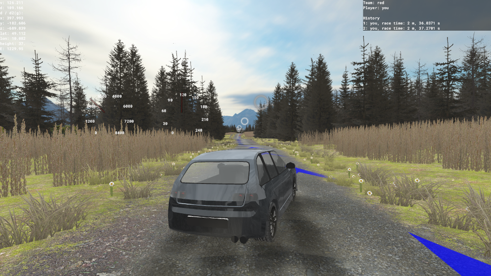
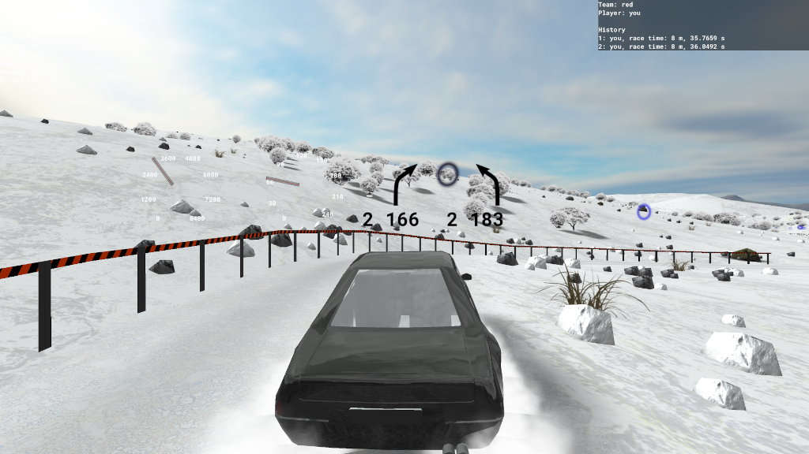

# MGame  

MGame is a rally game powered by **OpenStreetMap** data, bringing real-world maps to your gaming experience!  

## Features  
- **Real-world map integration**: Drive on tracks based on OpenStreetMap data.  
- **Cross-platform support**: Play on Linux, Windows, or Android.  
- **Dynamic environments**: Explore stages with varying times of day and weather.  

## Getting Started

### Download
You can download the latest version of MGame from the [Releases](https://github.com/gre-42/MGame/releases) section on GitHub for **Windows** and **Linux**.

For Android devices, download the game directly from [Google Play](https://play.google.com/store).  

### Installation  
1. **Computer**:  
   - Download the appropriate executable for your system from the [Releases](https://github.com/gre-42/MGame/releases) page.  
   - Extract the downloaded file and run the executable.  

2. **Android**:  
   - Visit the [Google Play Store](https://play.google.com/store/apps/details?id=com.hallo2hallo.vanillarally) and search for "MGame".  
   - Download and install the app.  

### Controls  
- **Keyboard**:  
  - WASD keys to steer.
  - ESC for the menu.
- **Controller**:
  - Look in the ESC-Menu in "Controller"

## Screenshots  
Take a sneak peek into the gameplay experience:  

### Realistic Tracks
- **Großglockner High Alpine Road**

- **New York City**

- **New York City (fly)**

- **New York City (at night)**

### Themed Environments
- **Island 0**

- **Forest 0**

- **Desert 1**

- **Track JB**

- **Snow 1**

- **Retro race track 1**

- **Race track 0**

- **City 0**

### Fun Extras
- **Aircraft carrier 0**

- **Team deathmatch 0**

## Contributing  
We welcome contributions to make MGame even better! Here’s how you can help:
### Open an Issue
Directly under https://github.com/gre-42/MGame/issues with enough description. If its a bug, please add your Operating Systen and the version, also the version of the game you are playing. 

### Help developing
1. Fork the repository.  
2. Create a feature branch: `git checkout -b feature-name`.  
3. Commit your changes: `git commit -m 'Add some feature'`.  
4. Push to the branch: `git push origin feature-name`.  
5. Open a Pull Request.

### Translations
Want MGame in your language? Help translate by contributing to the localization files!

### Make your own map
Get creative! Get your own tracks using OpenStreetMap data. [Guide Coming Soon]

## License  
MGame does not have a license yet.

## Acknowledgments  
Special thanks to the [OpenStreetMap community](https://www.openstreetmap.org/) for providing high-quality mapping data. Join the OpenStreetMap community to contribute to the mapping data that powers MGame!
