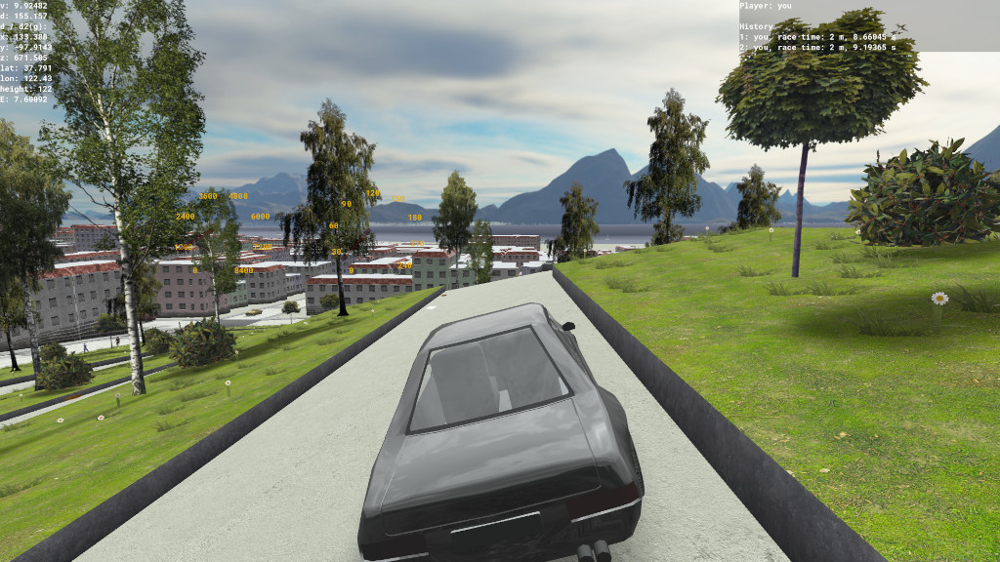

# MGame

A rally game based on OpenStreetMap data.

The [release section on GitHub](https://github.com/gre-42/MGame/releases) contains executables of the PC version (Linux and Windows), while the Android build can be downloaded [from Google Play](https://play.google.com/store/apps/details?id=com.hallo2hallo.vanillarally).

For instructions how to add a custom stage, see [CONTRIBUTING](CONTRIBUTING.md).

## Screenshots

### Track JB

### Snow 1

### Retro race track 1

### Island 0

### Forest 0

### Desert 1

### Race track 0

### Großglockner High Alpine Road

### New York City

### San Francisco

## Acknowledgments  

Special thanks to the [OpenStreetMap community](https://www.openstreetmap.org/) for
providing high-quality mapping data. Join the OpenStreetMap community to contribute
to the mapping data that powers MGame!
